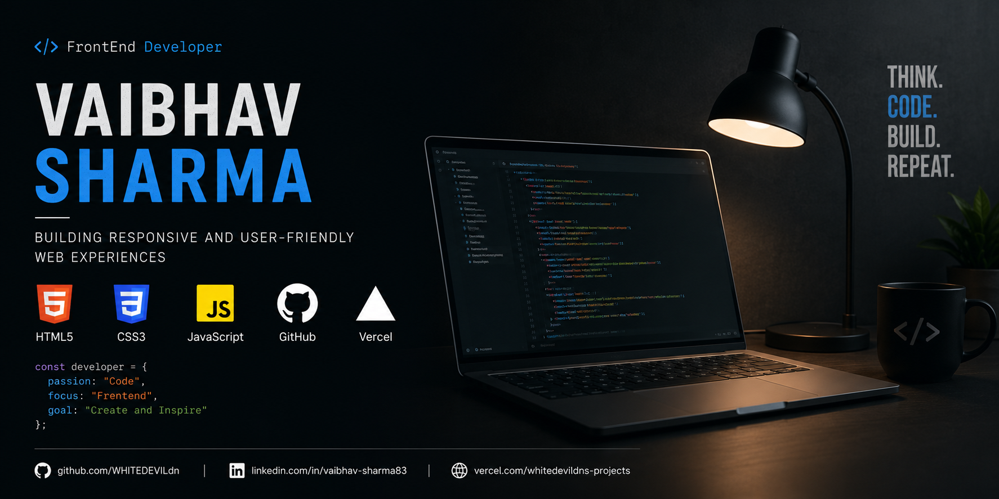
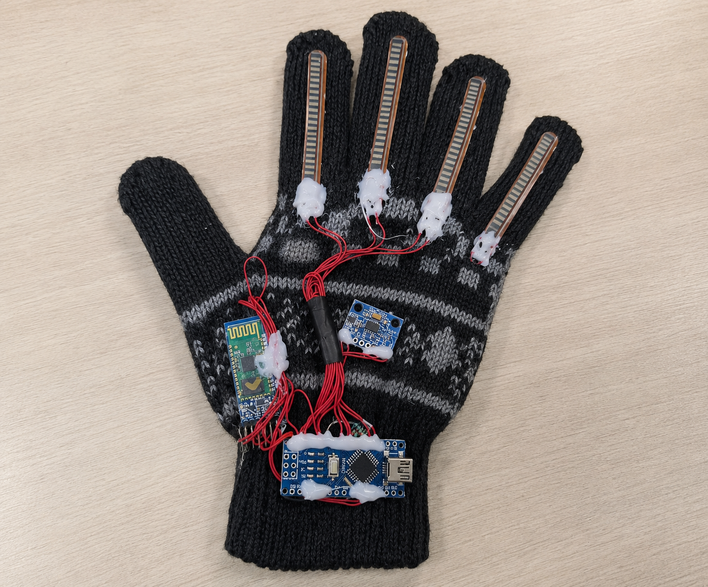

<h1 align="center">Hi 👋, I'm Vaibhav Sharma</h1>

<h3 align="center">
Frontend Developer • Building Modern Responsive Websites
</h3>

---

# 👨‍💻 About Me

🎓 Final Year B.Tech Student (Computer Science & Information Technology)

💻 Frontend Developer passionate about building clean and responsive websites

🌱 Continuously improving my JavaScript and frontend development skills

🚀 Developing real-world web projects

🤝 Open to Internship and Freelance Opportunities

📍 India

 

---

# 🛠 Tech Stack

---

# 🚀 Featured Projects

<table>

<tr>

<td width="50%" align="center">

### 🚗 Car Review Platform

Modern responsive website for browsing and comparing cars.

</td>

<td width="50%" align="center">

### 🏥 Medical University Website

Responsive medical university and healthcare platform.

</td>

</tr>

<tr>

<td width="50%" align="center">

### 🧤 Smart Glove

IoT-based gesture-to-text communication system.

</td>

<td width="50%" align="center">

### 🌐 Personal Portfolio

Personal portfolio showcasing my work and skills.

</td>

</tr>

</table>

---

# 📊 GitHub Statistics

---

# 🏆 GitHub Trophies

---

# 📜 Certifications

- AWS Academy Cloud Foundations
- Palo Alto Networks Cybersecurity
- Infosys Springboard JavaScript
- Python Essentials

---

# 📫 Connect With Me

---

⭐ If you like my work, consider giving a ⭐ to my repositories.

