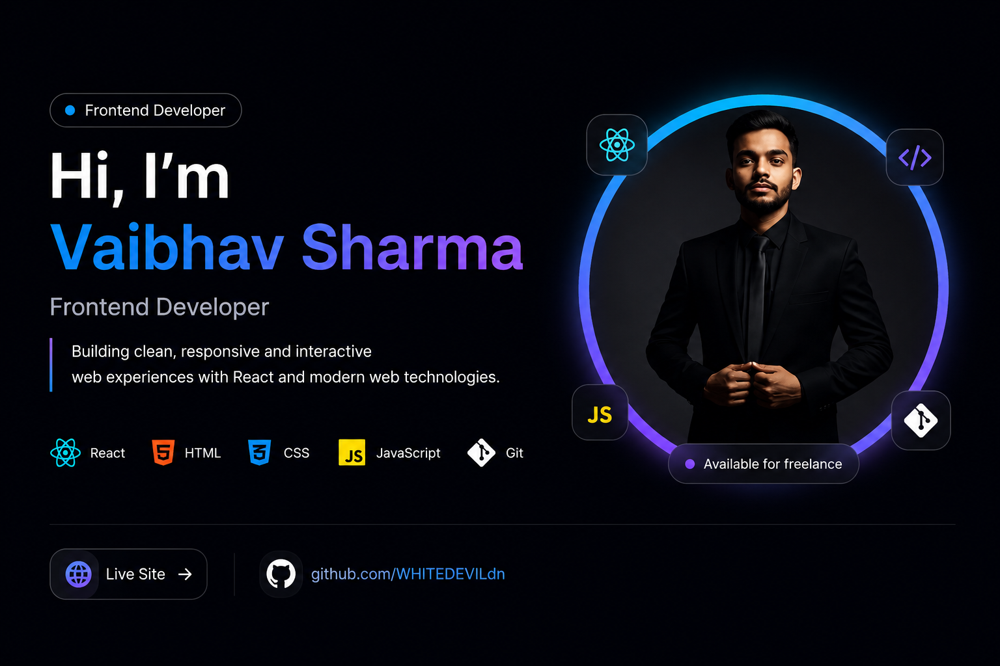

<h1 align="center">Hi 👋, I'm Vaibhav Sharma</h1>

<h3 align="center">
Frontend Developer • Building Modern & Responsive Web Experiences
</h3>

---

# 👨‍💻 About Me

🎓 **Final Year B.Tech Student** specializing in **Computer Science & Information Technology**.

💻 Passionate **Frontend Developer** focused on creating modern, responsive and user-friendly web experiences.

🚀 Skilled in building responsive websites using **HTML**, **CSS**, and **JavaScript** with clean and maintainable code.

🌱 Currently learning **Advanced JavaScript**, modern UI/UX principles, and frontend best practices.

💼 Open to **Frontend Developer**, **Internship**, and **Freelance** opportunities.

🎯 Goal: Build high-quality web applications that deliver excellent user experiences.

📍 **India**

 

---

# 🛠 Tech Stack

---

# 🚀 Featured Projects

<table>

<tr>

<td width="50%" align="center">

### 🚗 Car Review Platform

A modern responsive web application for exploring, reviewing and comparing cars with a clean interface, intuitive navigation and mobile-friendly design.

</td>

<td width="50%" align="center">

### 🏥 Medical University Website

A premium healthcare and university website featuring responsive layouts, modern UI, engaging animations and a professional user experience.

</td>

</tr>

<tr>

<td width="50%" align="center">

### 🧤 Smart Glove

An IoT-based innovation that converts sign language gestures into text and speech, helping improve communication for people with hearing and speech impairments.

</td>

<td width="50%" align="center">

### 🌐 Personal Portfolio

A personal portfolio showcasing my projects, certifications, technical skills, achievements and professional journey with a modern responsive design.

</td>

</tr>

</table>

# 📊 GitHub Statistics

# 📊 GitHub Statistics

---

# 📜 Certifications

✅ AWS Academy Cloud Foundations

✅ Palo Alto Networks Cybersecurity Foundation

✅ Infosys Springboard JavaScript

✅ Python Essentials

---

# 💡 Current Focus

- 🚀 Building responsive and modern frontend web applications.
- 🌐 Creating clean, user-friendly, and accessible interfaces.
- 📚 Learning advanced JavaScript and frontend development.
- 💼 Looking for Frontend Developer Internship opportunities.
- 🤝 Available for Freelance Web Development projects.
- 📈 Continuously improving problem-solving and development skills.

---

# 📫 Connect With Me

---

# 🤝 Let's Connect

💬 I'm always interested in collaborating on exciting web development projects.

🌱 I enjoy learning new technologies and building real-world applications.

⭐ Feel free to explore my repositories and connect with me.

---

<h3 align="center">
⭐ Thanks for Visiting My GitHub Profile ⭐
</h3>

If you like my work, consider giving my repositories a ⭐.

Let's build something amazing together! 🚀

